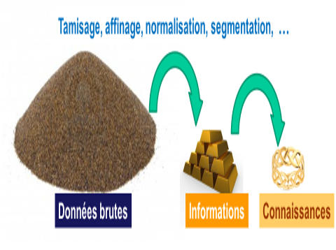
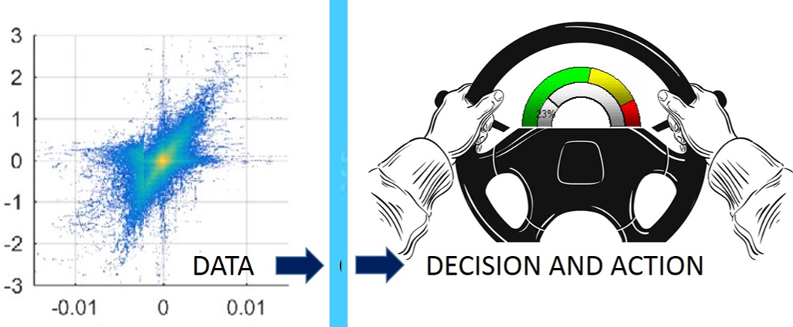

## HISTOIRE DES DATA
### Petite histoire des données en informatique et dans la vie en général

#### Introduction
En mathématiques, les données sont des quantités connues dans l'énoncé d'un problème et qui servent à trouver la solution. 
On parle alors des données d'un problème.

En informatique, on considère les données comme l'ensemble des indications enregistrées en machine afin de permettre l'analyse et/ou la recherche automatique des informations à partir de ces données. 
On parle ainsi de "jeu de donnnées", de "base de données", de "banque de données", d' "entrepôt de données", de "données documentaires", de "données lexicales", de "données géolocalisées", de "métadonnées", etc.
Tout cela pour alimenter un système d'information, un système informatique, une application logicielle, etc.

Une donnée est usuellement ce qui est connu _a priori_ et qui sert de point de départ à un raisonnement ayant pour objet la détermination d'une solution à un problème en relation avec cette donnée. 
Une donnée peut être une description élémentaire qui vise à objectiver une réalité ou bien le résultat d'une comparaison entre deux événements du même ordre (i.e. une mesure).
Ainsi, les données sont, en quelque sorte, des valeurs brutes d'observation et/ou elles proviennent d'une source de mesures.
Idéalement, les données sont exprimées dans un format connu et codifié reconnu par une large communauté d'utilisateurs.

Par extension, les données peuvent être produites par une fonction, un système, un logiciel et/ou une machine. Ainsi les données en sortie (_output data_) d'un système peuvent devenir les données en entrée (_input data_) d'un autre système.

La donnée brute est dépourvue de tout raisonnement, supposition, constatation, probabilité. Elle est brute. Ainsi, elle peut servir de base à une recherche, à un processus d'étude ou de validation, à examen statistique, à un raffinage, etc.

La nature des données peut être très variée selon leur source : des chifres, des lettres, des éléments complexes tels que des vecteurs ou des matrices, des ensembles structurés ou non-structurés, etc.

Jusqu'à récemment (disons quelques décennies), nous n'avions connaissance du monde réel qu'à travers la stimulation de nos sens naturels : vue, ouïe, odorat, goût et/ou toucher. Plus récemment, grâce à l'informatique, aux télécommunications et autres technologies numériques, nous avons pu déployer des systèmes capables de produire des données et de les traiter ensuite à notre place.

Avec le foisonnement des données, en informatique, on s'est alors mis à parler de _Data Processing_, de _Data Base_, d'_Open Data_, de _Big Data_, etc. 

On n'accumule pas les données pour le plaisir. On le fait, en général, avec une intention ou un objectif. Par exemple, on veut en extraire des éléments statistiques, apprendre de nouvelles connaissances, aider à prendre des décisions ou automatiser des prises de décisions, activer des mécanismes ou des robots, etc.

Pour simplifier, retenons une image : les données sont comme un minerai brut dont on peut extraire des informations après raffinage. Ces informations raffinées permettent ensuite de produire des connaissances plus ou moins élaborées sur la base desquelles on pourra prendre des décisions et, le cas échéant, déclencher des actions ciblées en fonction des connaissances élaborées.

#### Fig.1  - Transformation graduelle des données en informations puis connaissances puis action

#  
#  
Une autre analogie est la visualistion des données (sous forme d'un tableau de bord adéquat) pour décider et agir.

#### Fig.2  - Partir des données pour décider et agir

#  
#  

## Pour en savoir plus sur ce thème

- Source : [CNRTL](https://www.cnrtl.fr/definition/donn%C3%A9e)
- Source : [Wikipedia](https://fr.wikipedia.org/wiki/Donn%C3%A9e)
- Source : [Histoire illustrée de l'informatique](https://laboutique.edpsciences.fr/produit/1255/9782759827053/histoire-illustree-de-l-informatique)

  

#### WORK IN PROGRESS / CHANTIER EN COURS
#### Titre encore plus petit

