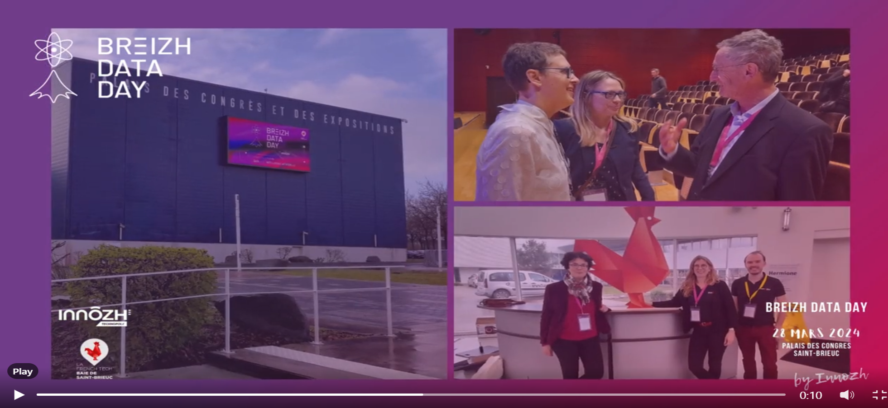

## Breizh Data Day 2024 - Photos souvenirs

### L'Affiche 

**L'Affiche du Breizh Data Day 2024**
>

### Le Palais

**Le Palais des Congrès de Saint-Brieuc**
>

### La Keynote du matin

**Zinnya DEL VILLAR (Data-pop Alliance)**
>Zinnya DEL VILLAR a ouvert la journée avec la conférence « Construire un avenir inclusif et durable : L'IA au Service du Bien Commun ».

### Le programme dans la salle "Le Grand Léjon"

**Le programme des conférences TECH**
> Le Grand Léjon est un phare qui signale l'entrée nord de la baie de Saint-Brieuc.

### Le programme dans la salle "Doris"

**Le programme des conférences RETEX**
> Un Doris est une embarcation à fond plat utilisée par les pêcheurs de morues à Terre-Neuve ou en Islande.

### Charles DELANNOY & Mouad HILALI (Doctolib)

**Comment optimiser une énorme base de données ? En optimisant les index . . .**
> Charles DELANNOY (sur la photo)

### Stéphanie LESCARRET (ACSystème)

**Nutrition animale et data visualisation : comment montrer aux éleveurs la
performance de leur élevage ?**
>

### Vincent DUBREUIL (LETG - Université de Rennes 2)

**Suivi des îlots de chaleur à Rennes par un réseau de stations connectées**
> Comment utiliser les données (température, pluviomètrie, etc.) pour anticiper les effets du réchauffement climatique.
> Le Professeur DUBREUIL est également, depuis 2022, Co-Président du Haut Conseil Breton pour le Climat (HCBC)

### Jean-Luc TROMPARENT (Hellowork)

**Mojo, le futur langage de l’IA ?**
> Mojo est un langage de programmation apparu en 2023 qui vise à combiner la facilité d'utilisation du langage Python avec les performances d'un langage de programmation de plus bas niveau (cf. les langages C et C++).

### Présentation des usages possibles de l'I.A. et des Data par la SNCF en Bretagne

**L'I.A. et les Data au service des trains régionaux**
 >La SNCF était un sponsor Platinum de la journée

### Les principaux organisateurs du Breizh Data Day 2024

**Echanges pour débriefer en fin de journée**
>

### La véritable cheville ouvrière du Breizh Data Day 2024

>
**Merci beaucoup Elodie pour votre dynamisme et votre efficacité !**
>
>

---

## [|||||||||] 
>
## Pour en savoir plus sur ce thème

- Source 1 : [Site web du Breizh Data Day](https://breizhdataday.innozh.fr/)

---

## [Retour au sommaire](https://dcn-prof.github.io/breizhdataclub/)
  
>

>  *  Version 2024-06-04
