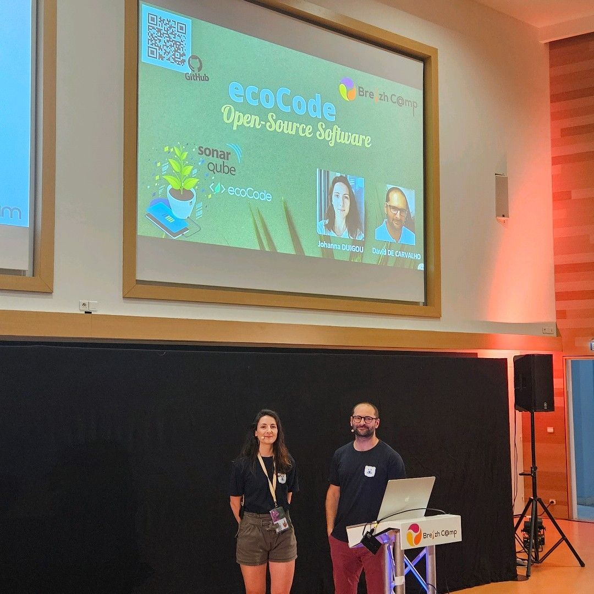

## Breizh Data Day 2024 - Photos souvenirs

### L'Affiche 

**L'Affiche du Breizh Data Day 2024**
>
### Le Palais

**Le Palais des Congrès de Saint-Brieuc**
>

### La Keynote du matin

**Zinnya Del Villar (Data-pop Alliance)**
>Zinnya Del Villar a ouvert la journée avec la conférence « Construire un avenir inclusif et durable : L'IA au Service du Bien Commun ».

#### Photo 004

**Légende n°4**

#### Photo 005

**Légende n°5**

#### Photo 006

**Légende n°6**
> Commentaire annexe sur cette photo

---

## [|||||||||] 
>
## Pour en savoir plus sur ce thème

- Source 1 : [Site web du Breizh Data Day](https://breizhdataday.innozh.fr/)

---

## [Retour au sommaire](https://dcn-prof.github.io/breizhdataclub/)
  
>

>  *  Version 2024-06-03
