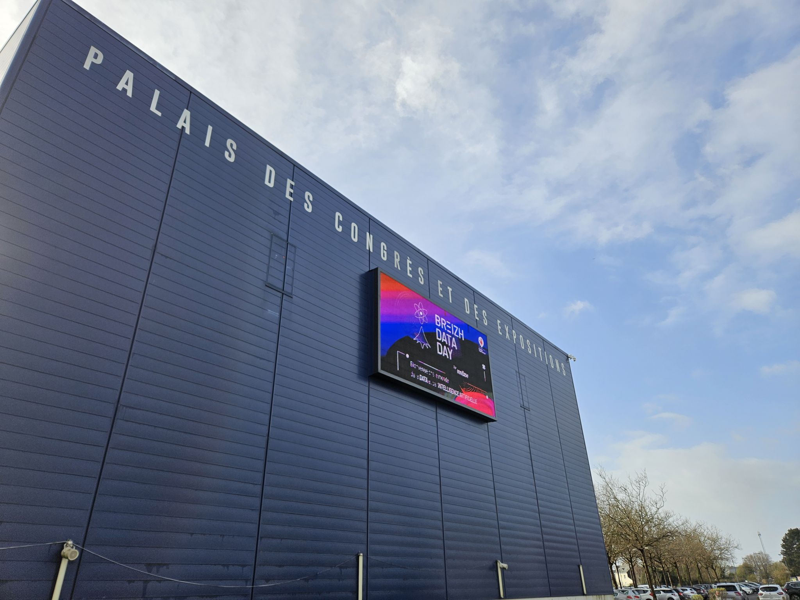
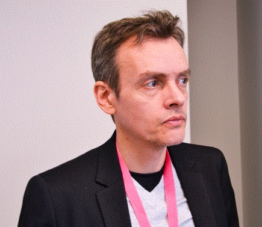
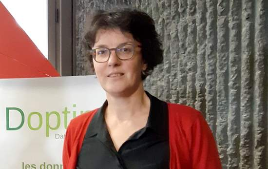

## Breizh Data Day 2024 - Photos souvenirs

### L'Affiche 

**L'Affiche du Breizh Data Day 2024**
>

### Le Palais

**Le Palais des Congrès de Saint-Brieuc**
>

### La Keynote du matin

**Zinnya DEL VILLAR (Data-pop Alliance)**
>Zinnya DEL VILLAR a ouvert la journée avec la conférence « Construire un avenir inclusif et durable : L'I.A. au Service du Bien Commun ».

### Le programme dans la salle "Le Grand Léjon"

**Le programme des conférences TECH**
> Le Grand Léjon est un phare qui signale l'entrée nord de la baie de Saint-Brieuc.

### Julien PERRON & Victor KLÖTZER (Ouest France)

**Ouest-France, de l'I.A. dans le quotidien : traitements de données multimodales appliqués aux contenus éditoriaux**
> 

### Arnaud VALENCE (ESIEA) 
 

**I.A. génératives/conversationnelles : opportunités et menaces** 
>  

### Sylvain BARTHELEMY (Gwenlake)
  
**I.A. générative et Unified Knowledge source pour les entreprises** 
> 

###  Sophie TARDIVEL (Doptim) 
 

**L'I.A. pour évaluer la qualité des soudures et moins gaspiller**
> Merci beaucoup Sophie pour ce remplacement, au pied levé, de la conférence de Basile Brochut (Marine Weather Intelligence) prévue initialement sur ce créneau.
> 

### Thomas WENTZ (Speredia)
  
**A.I. Act : vers la régulation des Intelligences Artificielles dans l’U.E.** 
> 

### Arthur HOARAU (IRISA)
  
**Réduction des coûts d’étiquetage en intelligence artificielle** 
> 

### Charles DELANNOY & Mouad HILALI (Doctolib)

**Comment optimiser une énorme base de données ? En optimisant les index . . .**
> Charles DELANNOY (sur la photo)

### Présentation des usages possibles de l'I.A. et des Data par la SNCF en Bretagne

**L'I.A. et les Data au service des trains régionaux**
 >La SNCF était un sponsor Platinum de la journée

### Laurent MONTEIRO & Johann PROD’HOMME (LMSYS)
  
**Micro-datacenter local, une alternative responsable pour répondre aux enjeux
de réappropriation et de souveraineté des données** 
>

### Jean-Luc TROMPARENT (Hellowork)

**Mojo, le futur langage de l’I.A. ?**
> Mojo est un langage de programmation apparu en 2023 qui vise à combiner la facilité d'utilisation du langage Python avec les performances d'un langage de programmation de plus bas niveau (cf. les langages C et C++).

### Le programme dans la salle "Doris"

**Le programme des conférences RETEX**
> Un Doris est une embarcation à fond plat utilisée par les pêcheurs de morues à Terre-Neuve ou en Islande.

### Vincent ROCCHISANI (Groupe Roullier)
  
**La Transformation Data du Groupe Roullier** 
> 

### Mylène MAIGNANT (Wenvision)
  
**Acculturer est la clé du succès de l’IA générative en entreprise** 
> 

### Emmanuelle GUYOT (Groupama Loire Bretagne)
  
**L’I.A. au service de l'amélioration de l'expérience client** 
> 

### Stéphanie LESCARRET (ACSystème)

**Nutrition animale et data visualisation : comment montrer aux éleveurs la
performance de leur élevage ?**
>

### Solenn LE BOUCHER & Stéphane BIZET (Le Guen & Associés)
    
**I.A., Data et Propriété Industrielle** 
> 

### Nicolas HUCHE  (Néosoft)
  
**Guide pratique vers une Data plus responsable** 
>

### Vincent DUBREUIL (LETG - Université de Rennes 2)

**Suivi des îlots de chaleur à Rennes par un réseau de stations connectées**
> Comment utiliser les données (température, pluviomètrie, etc.) pour anticiper les effets du réchauffement climatique.
> Le Professeur DUBREUIL est également, depuis 2022, Co-Président du Haut Conseil Breton pour le Climat (HCBC)

### Emmanuel FRENOD  (SEE-D)
  
**Jumeaux Numériques Apprenants pour le Pilotage Robuste d’élevages de poules pondeuses** 
>

### Voici venu le moment de conclure le Breizh Data Day 2024

**Bénédicte LE GOUIL, Directrice d'INNÔZH monte sur la scène du Grand Léjon**

### Remerciements pour tous les participants venus au Breizh Data Day 2024

**Bilan en fin de la journée : 390 personnes sont venues à l’événement.**
>

### Remerciements pour l'équipe d'INNÔZH qui a oeuvré en coulisse 

**Bénédicte LE GOUIL, Directrice d'INNÔZH, entourée de ses co-équipières**
>

### Remerciements pour l'équipe d'INNÔZH qui a oeuvré en coulisse 

**Sans oublier celles qui ont mis de l'huile dans les rouages tout au long de la journée**
>

### Débriefing avec quelques membres du ComEd (Comité éditorial) du Breizh Data Day 2024 

**Elaborer le programme des conférences, tel est le job du ComEd** 
>L'objectif du ComEd est de satisfaire le public tout en se faisant plaisir . . .

>

### La véritable cheville ouvrière du Breizh Data Day 2024

>
**Merci beaucoup Elodie pour votre dynamisme et votre efficacité !**
>
>

---

## [|||||||||] 
>
## Pour en savoir plus sur ce thème

- Source 1 : [Site web du Breizh Data Day](https://breizhdataday.innozh.fr/)

---

## [Retour au sommaire](https://dcn-prof.github.io/breizhdataclub/)
  
>

>  *  Version 2024-06-08
