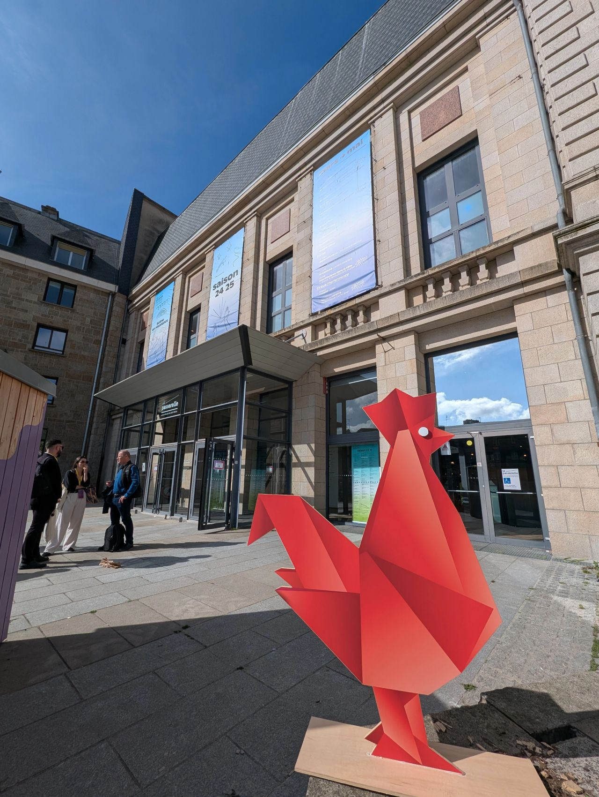
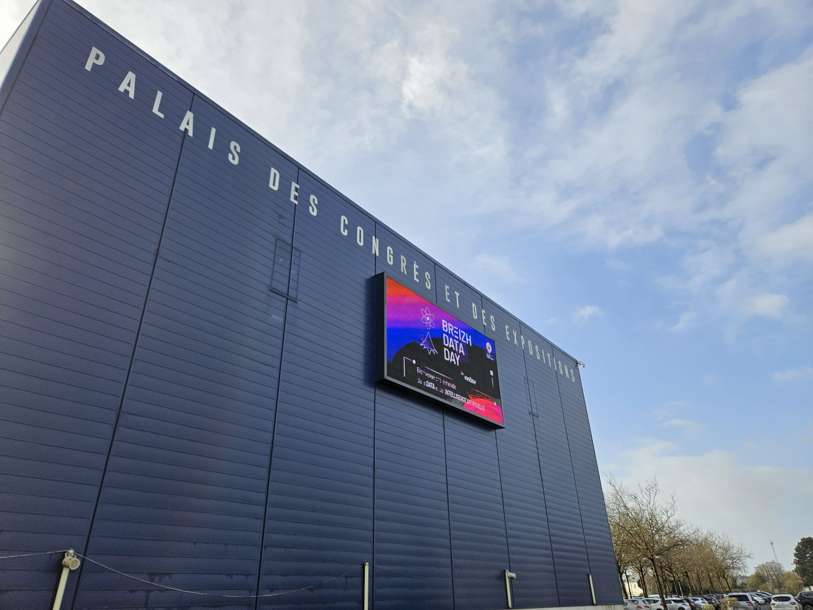
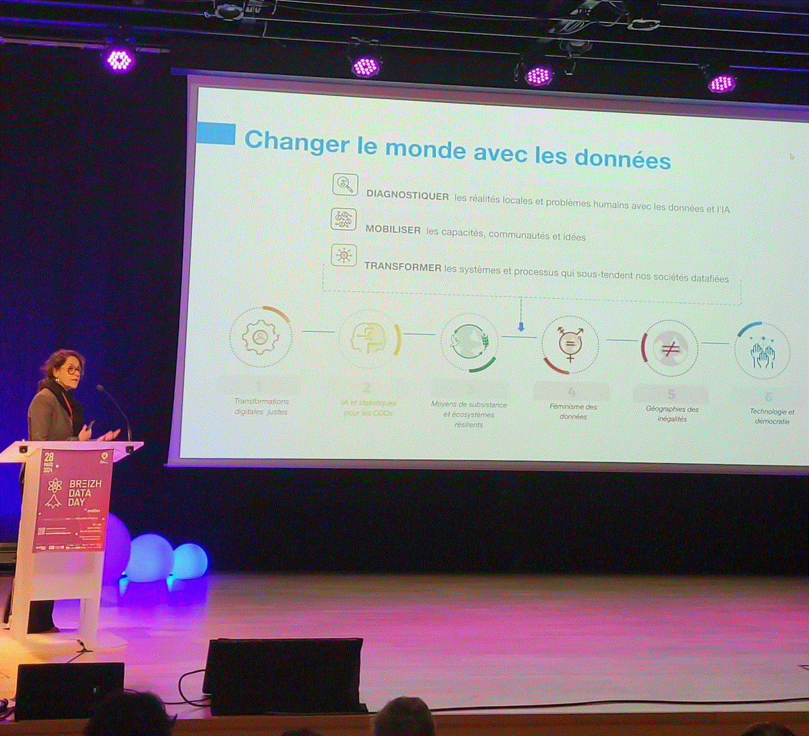
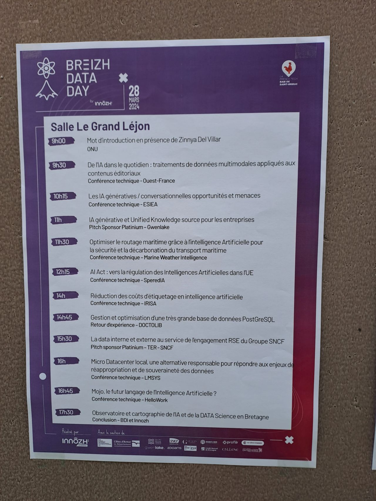
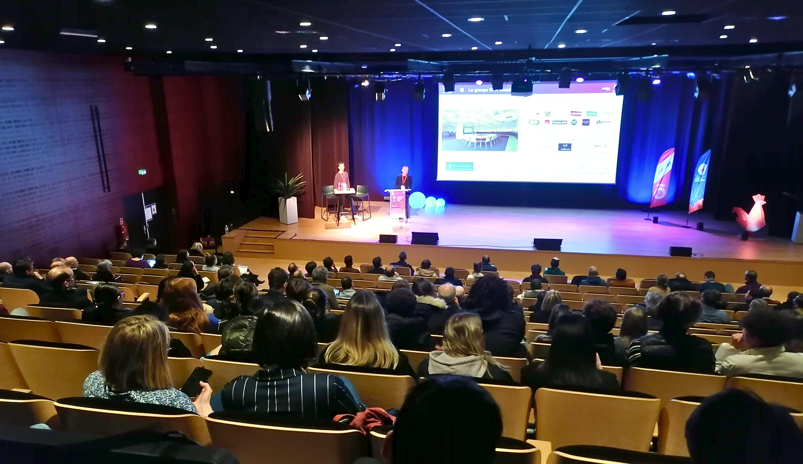
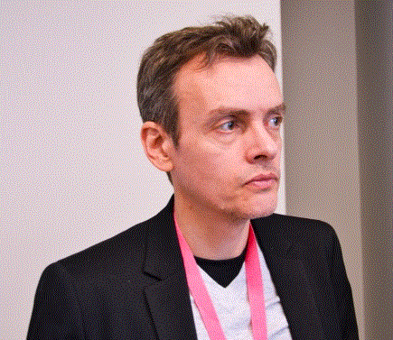
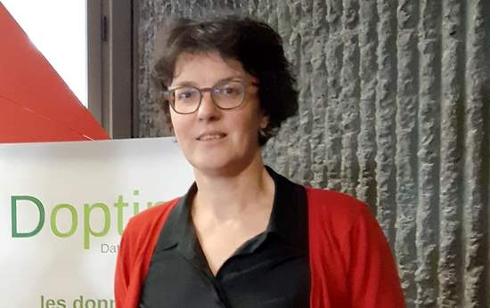
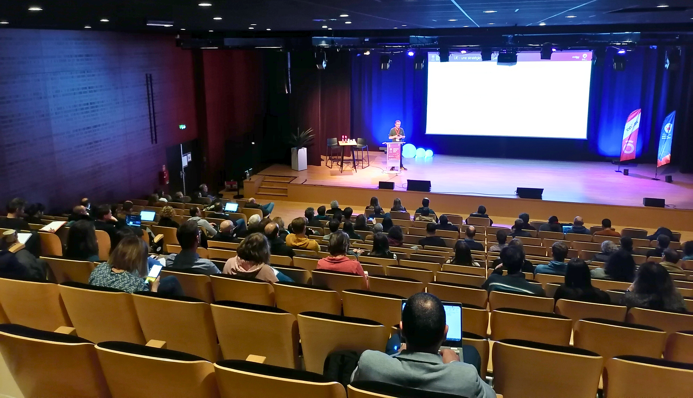
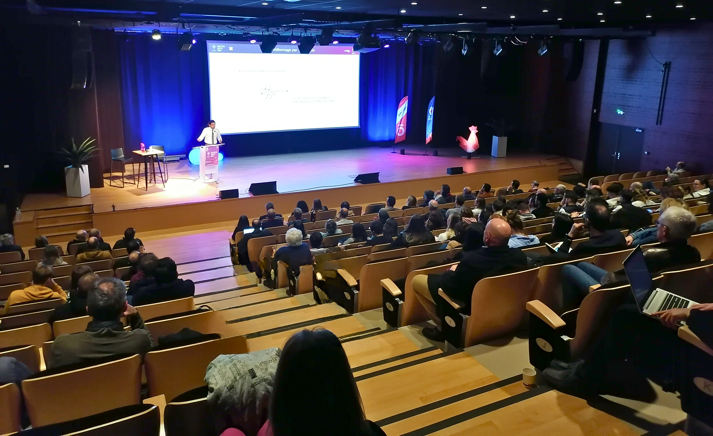

## Breizh Data Day 2025 - Photos souvenirs

### Le Théâtre "La Passerelle" de Saint-Brieuc

**Le Théâtre "La Passerelle" de Saint-Brieuc**
>

### Le théâtre "La Passerelle"

**La Passerelle de Saint-Brieuc**
>

### La Keynote du matin

**Zinnya DEL VILLAR (Data-pop Alliance)**
>Zinnya DEL VILLAR a ouvert la journée avec la conférence « Construire un avenir inclusif et durable : L'I.A. au Service du Bien Commun ».

### Le programme dans la salle "Le Grand Léjon"

**Le programme des conférences TECH**
> Le Grand Léjon est un phare qui signale l'entrée nord de la baie de Saint-Brieuc.

### Julien PERRON & Victor KLÖTZER (Ouest France)

**Ouest-France, de l'I.A. dans le quotidien : traitements de données multimodales appliqués aux contenus éditoriaux**
> 

### Arnaud VALENCE (ESIEA) 
 

**I.A. génératives/conversationnelles : opportunités et menaces** 
>  

### Sylvain BARTHELEMY (Gwenlake)
  
**I.A. générative et Unified Knowledge source pour les entreprises** 
> 

###  Sophie TARDIVEL (Doptim) 
 

**L'I.A. pour évaluer la qualité des soudures et moins gaspiller**
> Merci beaucoup Sophie pour ce remplacement, au pied levé, de la conférence de Basile Brochut (Marine Weather Intelligence) prévue initialement sur ce créneau.
> 

### Thomas WENTZ (Speredia)
  
**A.I. Act : vers la régulation des Intelligences Artificielles dans l’U.E.** 
> 

### Arthur HOARAU (IRISA)
  
**Réduction des coûts d’étiquetage en intelligence artificielle** 
> 

### Remerciements pour tous les participants venus au Breizh Data Day 2025

**Bilan en fin de la journée : 370 personnes sont venues à l’événement.**
>

### Remerciements à l'équipe d'INNÔZH qui a oeuvré en coulisse 

**Le Breizh Data Day, c'est un vrai travail d'équipe. Avec des personnes sur la scène et d'autres dans les coulisses.**
On ne soulignera jamais assez l'importance du travail réalisé en coulisse . . .
Ce sont eux qui mettent de l'huile dans les rouages tout au long de la journée.
>

---

## [|||||||||] 
>
## Pour en savoir plus sur ce thème

- Source 1 : [Site web du Breizh Data Day](https://breizhdataday.innozh.fr/)
