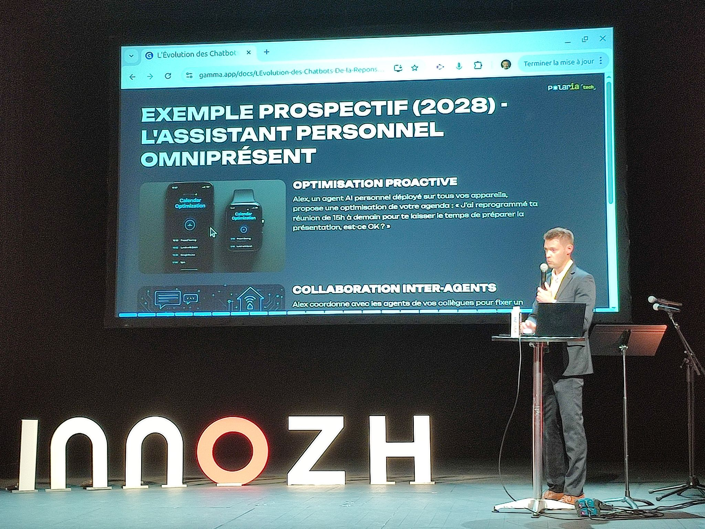
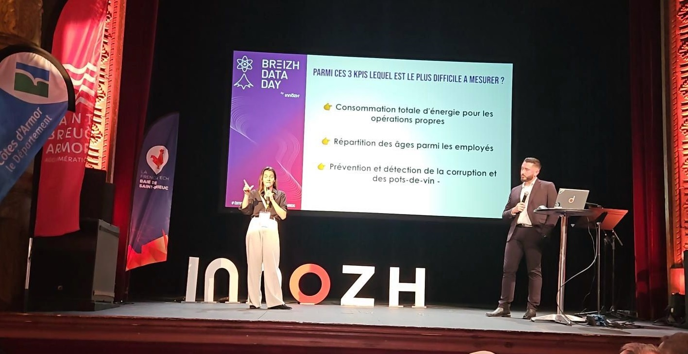

## Breizh Data Day 2025 - Photos souvenirs

### Le Théâtre "La Passerelle" de Saint-Brieuc

**Fig. 1 - Le Théâtre "La Passerelle" de Saint-Brieuc**
>

### KEYNOTE. Les I.A., aujourd’hui et demain
>Serge Abiteboul a ouvert la journée avec une conférence introductive sur le thème « Avec les I.A., où va-t-on ? ».
> Déjà présente dans le folklore et la science-fiction, l’intelligence artificielle a débarqué au 20ème siècle dans les sciences et la technologie, et plus récemment dans nos vies à tous.
> Bien sûr, aucune magie là-dedans. Mais la société doit comprendre, maitriser cette nouvelle technologie.
> Alors, où en est-on ? Et où va-t-on ?    
>

**Fig. 2 - La keynote matinale de Serge Abiteboul**
>

**Fig. 2-bis - Serge Abiteboul (INRIA, ENS Paris, Académie des Sciences)**
>

### RETEX. L'I.A. au service de l'analyse des opinions : Décrypter les tendances sociétales pour mieux agir

**Fig. 3 - Maryem Guizani et Léo Leydour (ENSAI Junior Consultant à Rennes)**

### RETEX. Optimiser la préparation de rendez-vous clients professionnels dans le domaine bancaire grâce à l’IA

**Fig. 4 - Manuel Duprey (NIJI à Rennes) et Christophe Laverrière (Banque Populaire Grand Ouest)**

### RETEX. L’I.A. pour tous, du fantasme à la réalité

**Fig. 5 - Jean-Philippe Prodhomme (ENEDIS à Rennes)**
> 

### Le Forum. Un lieu convivial de rencontres et d'échanges

**Fig. 6 - Pause-café**
> 

**Fig. 6-bis - Pause-déjeuner**
>
> 

### TECH. L'I.A. appliquée au service de la langue des signes : la phase critique de l'entraînement

**Fig. 7 - Thomas Roc (Electric Brain à Saint-Brieuc)**
>
>

### TECH. La valeur des données industrielles : Enjeux et opportunités dans une économie mondialisée

**Fig. 8 - Gaël Le Saux (Plasseraud-IP à Rennes)**
>
>

### RETEX. Au-delà du chatbot classique : un assistant intelligent et proactif.

**Fig. 9 - Alexis Lewalle (Polaria Tech à Vannes)**
>
>

### RETEX. "Vert" l'avenir : Microsoft Fabric et Power BI pour une transformation durable

**Fig. 10 - Appoline Herbinet et Enzo Rideau (Delaware à Rennes)**
>
>

### TECH. Intelligence Artificielle : quels impacts environnementaux ?
.png)
**Fig. 11 - David Allioux (The Shift Project)**

### TECH. MétéoData, récolter les données météo du Minitel au NB-IoT
.jpg)
**Fig. 12 - Laurent Georget (Meteo Concept)**

### Atelier. Transfomez votre entreprise avec l'I.A.
.jpg)
**Fig. 13 - Julie Bourrée (EDIH / Images & Réseaux)**

### TECH. Données spatiales et SIG : Trouver l’équilibre entre précision et performance
.jpg)
**Fig. 14 -  Halima Talab-Ou-Ali (SII - Ouest)**

### RETEX. Data et I.A. au service des enjeux du Groupe SNCF et d'une mobilité plus durable
k.jpg)
**Fig. 15 - Jean-Jacques Thomas (SNCF)**

### RETEX. Conformité ou compétitivité : L’IA Act oblige-t-il à choisir ?
.jpg)
**Fig. 16 - Léa Deswarte (Kereval à Rennes)**

## ???? /!\/!\/!\/!\/!\/!\/!\/!\/!\/!\ W V W V W V W V W V W 

## ???? /!\/!\/!\/!\/!\/!\/!\/!\/!\/!\ M A M A M A M A M A M

### Remerciements pour tous les participants venus au Breizh Data Day 2025

**Bilan en fin de la journée : 370 personnes sont venues à l’événement.**
>

### Remerciements à toute l'équipe d'INNÔZH et de La Passerelle qui ont oeuvré en coulisse au succès de cette journée.

**Le Breizh Data Day, c'est un vrai travail d'équipe. Avec des personnes sur la scène et d'autres dans les coulisses.**
On ne soulignera jamais assez l'importance du travail réalisé en coulisse . . .
Ce sont eux qui mettent de l'huile dans les rouages tout au long de la journée.
>

---

## [|||||||||] 
>
## Pour en savoir plus sur ce thème

- Source 1 : [Site web du Breizh Data Day](https://breizhdataday.innozh.fr/)
