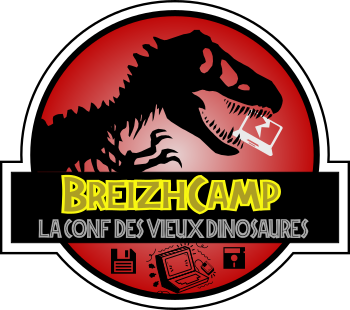
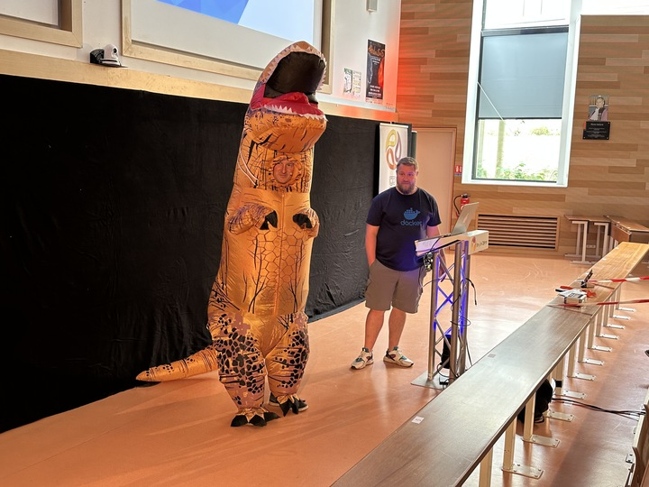
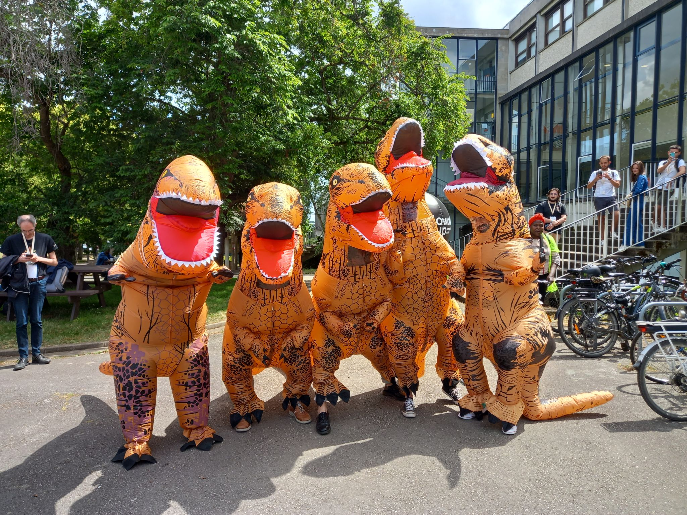
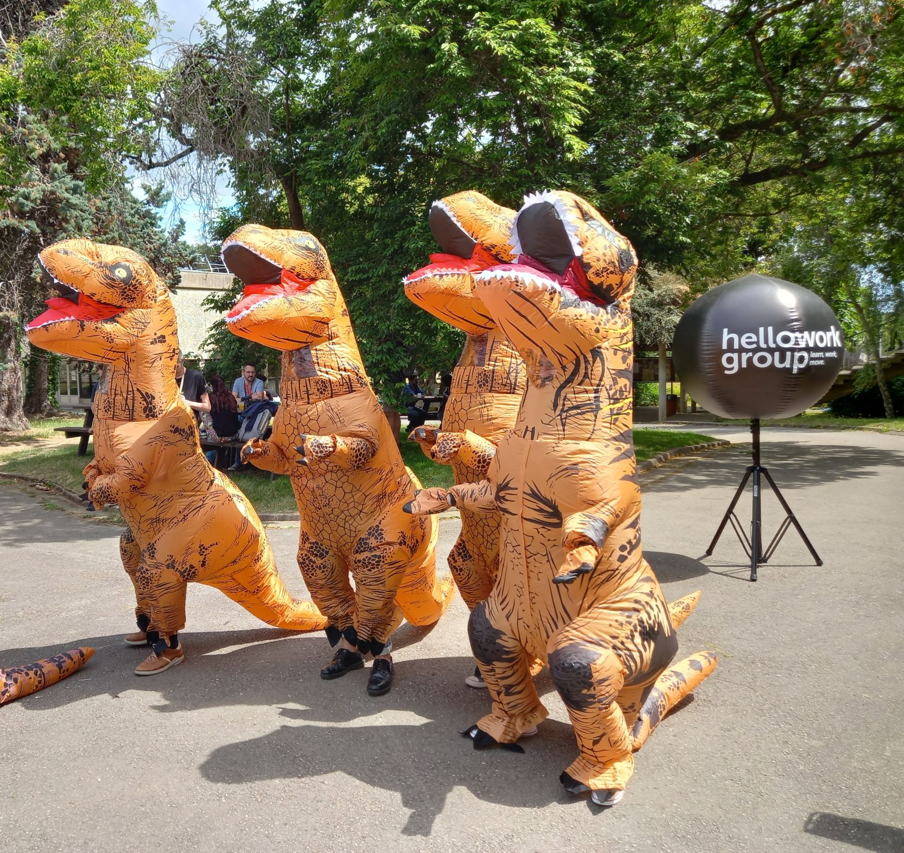
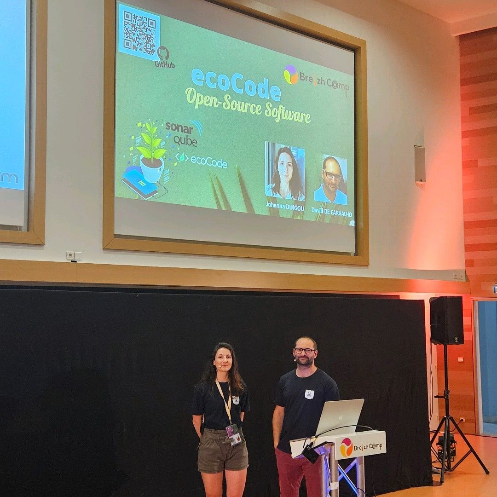

## BREIZHCAMP 2024 - Photos souvenirs

### Logo usuel de BreizhCamp

#### Bannière du BreizhCamp 2024

#### Instantané dans un amphi

#### Les stars prennent la pause au grand air 

#### Un autre photo des stars  

#### Non mais on a travaillé aussi . . .

Johanna DUIGOU et David DE CARVALHO présentent une conf sur **ecoCode**.
> Comment réduire l'empreinte écologique des logiciels.

---

## [|||||||||] 
>
## Pour en savoir plus sur ce thème

- Source 1 : [Vidéos des confs BreizhCamp 2023](https://www.youtube.com/playlist?list=PLv7xGPH0RMUQC6eKGeEXO4PzvKdsU7z2j)

---

## [Retour au sommaire](https://dcn-prof.github.io/breizhdataclub/)
  
>

>  *  Version 2024-06-29
