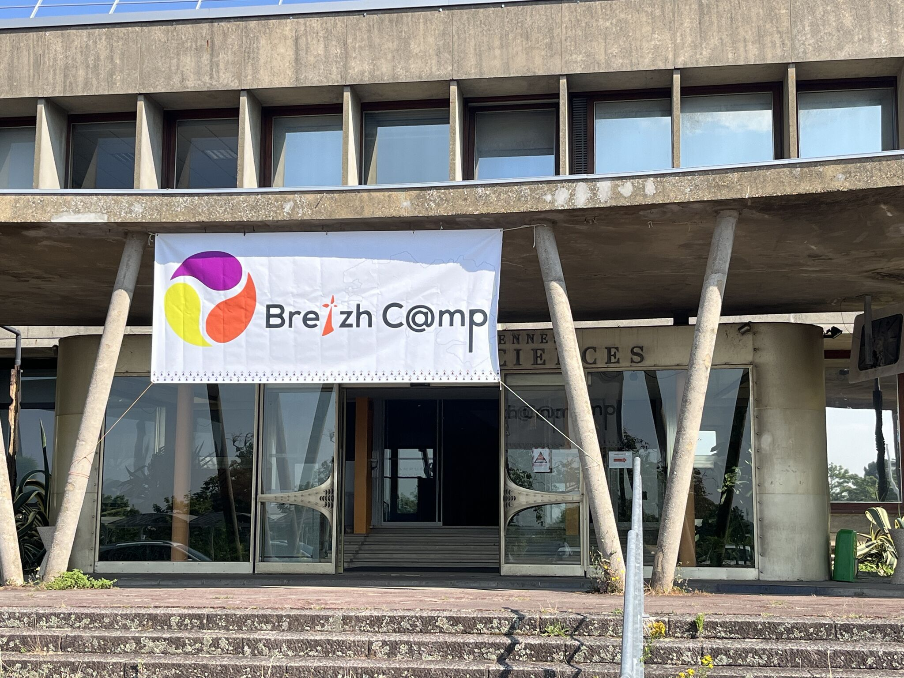
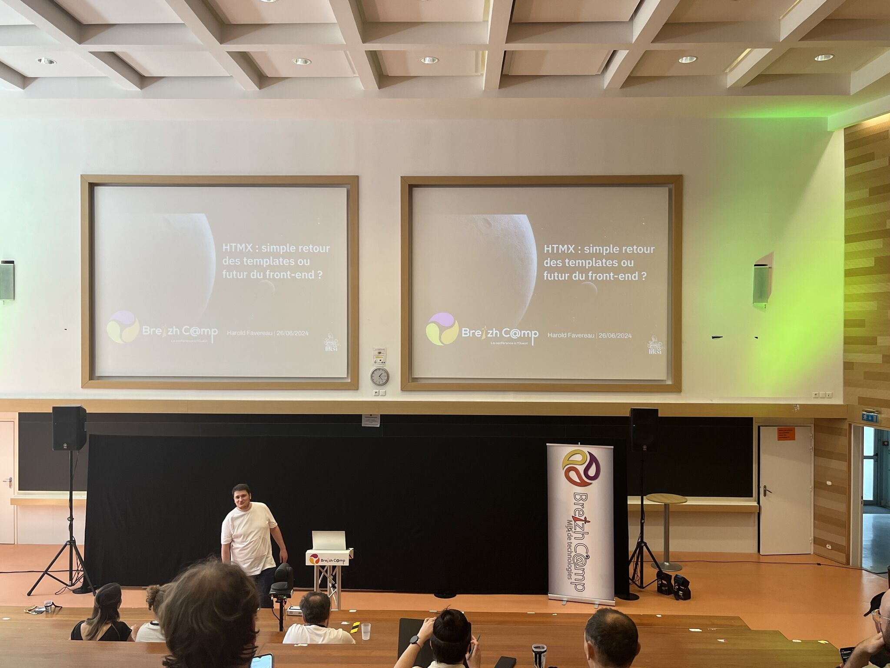

## BREIZHCAMP 2024 - Photos souvenirs

### Logo usuel de BreizhCamp

#### Bannière du BreizhCamp 2024

#### Entrée Sud de la Fac de Sciences lors du BreizhCamp 2024 (Université de Rennes 1 - Campus de Beaulieu)

#### Amphi E : Et si on ouvre grand les bras aux S.I.G. ? (Talab Ou Ali Halima /  Groupe SII)

#### Amphi E : HTMX - Retour aux templates ou futur front-end ? (Harold Faveraau /  LIKSI)

#### Amphi B : Un eseconde pour traiter un milliars de lignes en Java (Maxime Reynier /  One Point)

---

## [|||||||||] 
>
## Pour en savoir plus sur ce thème

- Source 1 : [Vidéos des confs BreizhCamp 2024 : A venir prochainement . . . ]

---

## [Retour au sommaire](https://dcn-prof.github.io/breizhdataclub/)
  
>

>  *  Version 2024-07-01
>  *  
