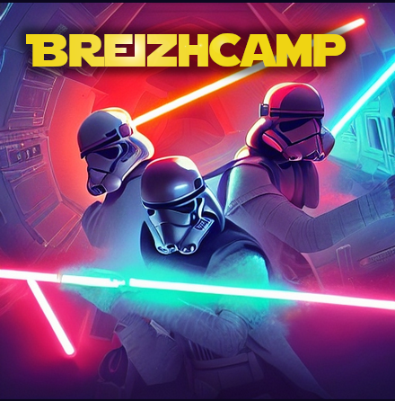
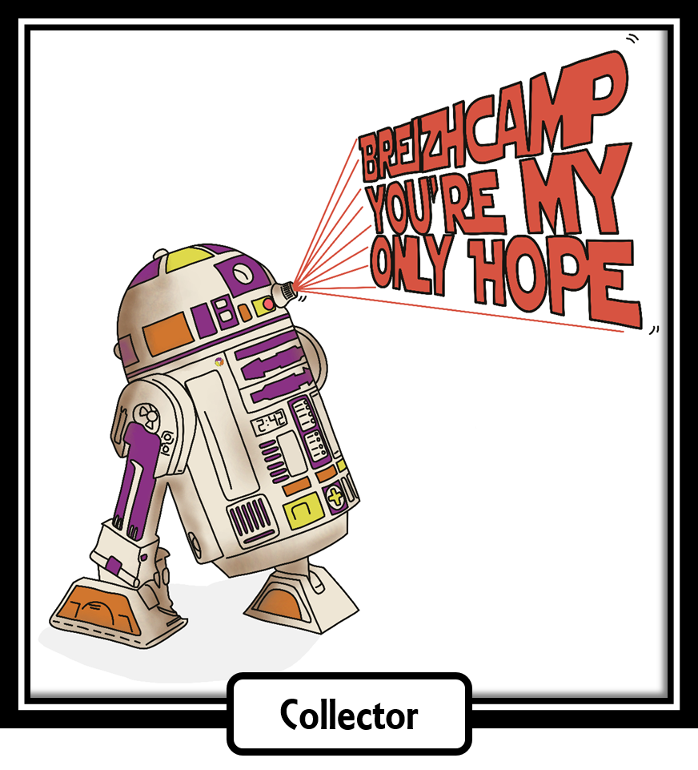
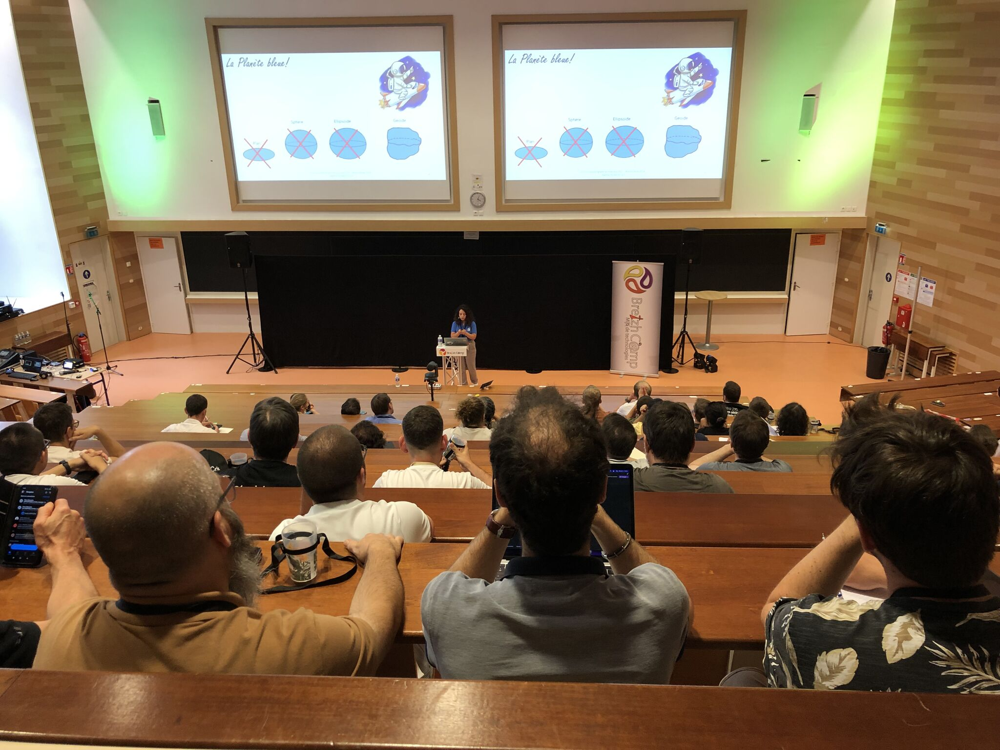
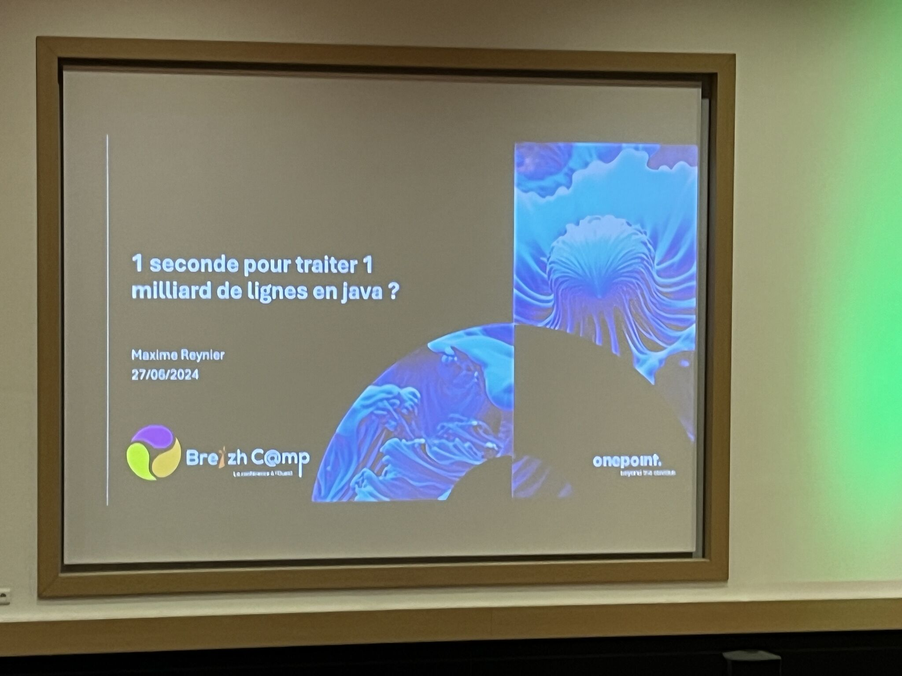
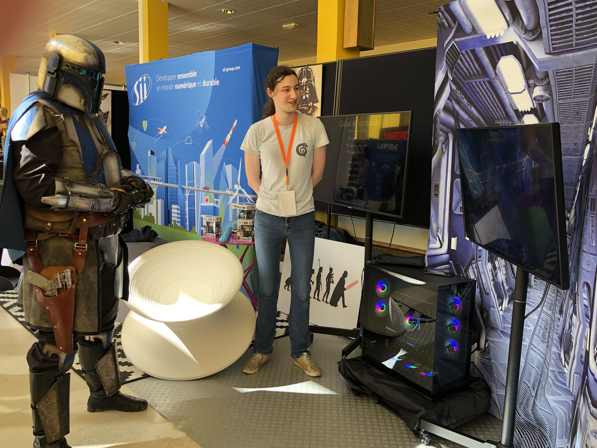

## BREIZHCAMP 2024 - Photos souvenirs

### Logo usuel de BreizhCamp

### Bannière du BreizhCamp 2024

### Illustration imprimée sur le tee-shirt du BreizhCamp 2024

#### Entrée Sud de la Fac de Sciences lors du BreizhCamp 2024 (Université de Rennes 1 - Campus de Beaulieu)

### Quelques conférences dans les amphis
### 

#### Amphi E : Et si on ouvre grand les bras aux S.I.G. ? (Talab Ou Ali Halima /  Groupe SII)

#### Amphi E : HTMX - Retour aux templates ou futur front-end ? (Harold Faveraau /  LIKSI)

#### Amphi B : Une seconde pour traiter un milliard de lignes en Java (Maxime Reynier /  One Point)

### Et aussi des rencontres en parallèle ou entre les conférences 
### 

#### Hall BreizhCamp : Rencontres et échanges sur les stands des sponsors

#### Hall BreizhCamp : Un guerrier inter-galactique sur le stand SII

### Et aussi d'autres occasions de rencontres non-programmées . . .  
### 

#### Légende de légende de légende

---

## [|||||||||] 
>
## Pour en savoir plus sur ce thème

- Source 1 : [Vidéos des confs BreizhCamp 2024 : A venir prochainement . . . ]

---

## [Retour au sommaire](https://dcn-prof.github.io/breizhdataclub/)
  
>

>  *  Version 2024-07-01
>  *  
