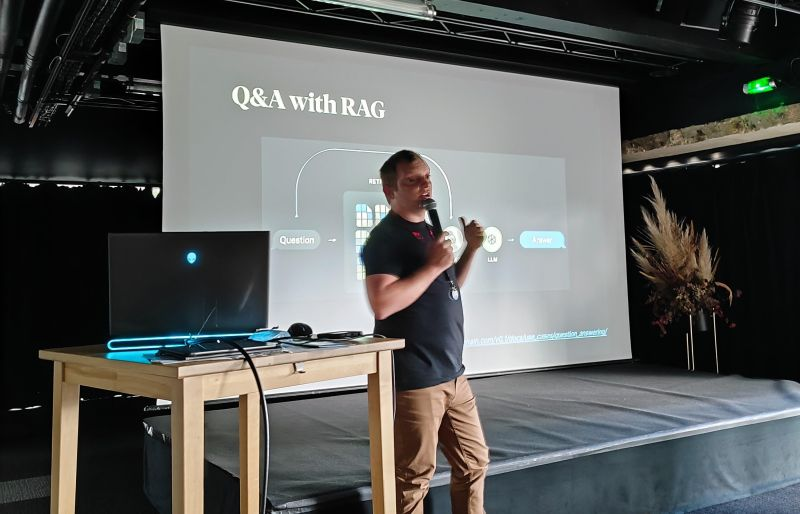

## Meetup du 2024-05-14

### RETEX sur la construction d'un bot conversationnel en approche RAG par Corentin Brémard (Skeepers)
Meetup Breizh Data Club / Mardi 14 mai 2024 à 18h30 / Le Mabilay à Rennes

Objectif : 90 minutes (Q/R incluses) pour partager un RETEX sur la construction d'un robot conversationnel basé sur une documentation d'entreprise en approche RAG (Retrieval Augmented Generation). Au travers de cette présentation, Corentin nous a dévoilé les techniques et astuces concrètes à mettre en place pour faire face aux réalités terrain.

GenAI, LLM, RAG... Des termes voisins dont la signification rappelle les subtiles différences entre une galette et une crêpe en Bretagne. Lors de la présentation, nous avons vu concrètement comment utiliser ces techniques au travers de Chat-SKP, le chatbot interne à Skeepers. Nous avons revu ensemble les différentes étapes de ce projet, ce qui fonctionne (ou pas) ainsi que les éventuelles adaptations en fonction des besoins. Suite à cette présentation, chacun des participants peut se lancer dans ce genre de projet en toute conscience des tenants et aboutissants.

Le Meetup a aussi été l'occasion de se réunir entre _data lovers_ le temps d'une petite collation qui a suivi la présentation. Corentin et les participants étaient ravis d'échanger entre pairs sur les nouvelles problématiques du quotidien d'un _Data Scientist_. 

### Corentin Brémard
_Data Scientist_ issu de l'ENSAI, Corentin a travaillé chez Advalo puis chez Skeepers depuis 10 ans. 
Expert en Machine Learning, l'expérience start-up a amené Corentin à s'auto-former afin de rester à la pointe de la technologie dans un contexte de montée en puissance du Big Data puis de la GenAI.

Au sein de Skeepers, Corentin adapte et éprouve les nouvelles techniques dans le vaste domaine du marketing.

### Skeepers
Créé en 2019, Skeepers accélère sa croissance au travers d'acquisitions, capitalisant plus d'une décennie d'innovation et de croissance. Avec plus de 450 employés dans des bureaux répartis dans 8 pays, Skeepers est un des leaders européens du Contenu Généré par les Utilisateurs (UGC, User Generated Content) pour l'engagement client. Skeepers aide les marques à développer des expériences impactantes pour les consommateurs. Skeepers propose une suite de solutions d'UGC qui offre une approche puissante et unique pour l'engagement des acheteurs. Skeepers permet aux marques d'exploiter tous les types d'UGC, de la création à la collecte, en passant par la gestion et l'activation. Grâce aux solutions innovantes, basées sur l'IA, proposées par Skeepeers, les marques peuvent offrir aux consommateurs des expériences authentiques et fiables. La présentation d'aujourd'hui sera l'occasion de découvrir comment on peut tirer parti des UGC.

#### Le Mabilay 
Immeuble de "Le Poool x La French Tech Rennes St-Malo"
  
- Adresse : 2 Rue de la Mabilais, 35000 Rennes

### Le conférencier

### Le lieu

## [|||||||||]

## Pour en savoir plus sur ce thème

- Source 1 : [Corentin Brémard](https://www.linkedin.com/in/corentinbremard/)

- Source 2 : [Breizh Data Club](https://www.linkedin.com/company/breizhdataclub/)

- Source 3 : [Breizh Data Club - posts](https://www.linkedin.com/company/breizhdataclub/posts/)
  
- Source 4 : [Skeepers](https://skeepers.io/fr/)

---

## [Retour au sommaire](https://dcn-prof.github.io/breizhdataclub/)
  
>

>  *  Version 2024-05-16
