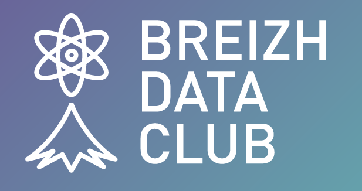

# Breizh Data Club

**_For Data Lovers Only_** 
>

## Bienvenue au Club !
* Vous cherchez une info ? C'est par ici. On vous dit tout . . . 
 
### Voici le sommaire . . .

|        Les infos        |  Date de mise à jour   |          Lien pour en savoir plus                  |
| :---------------------- |:----------------------:| --------------------------------------------------:|
|      Dernière info      |     2024-04-20         |  <https://breizhdataday.innozh.fr/>                |
|      BreizhCamp 2024    |     2024-04-20         |  <https://www.breizhcamp.org/>                     |
|     Journal Le Monde    |     2024-04-20         |  <https://www.lemonde.fr>                          |
|                         |                        |                                                    |
|                         |                        |                                                    |
|                         |                        |                                                    |
|                         |                        |                                                    |
|                         |                        |                                                    |
|                         |                        |                                                    |
|                         |                        |                                                    |
|     Test of Binder      |      2024-04-20        |<https://dcn-prof.github.io/breizhdataclub/Binder/File_002/>                        |
|   Histoire du B.D.Club  |     2024-04-23         |                                                    |
|   Histoire des Data     |     2024-04-23         |     <https://dcn-prof.github.io/breizhdataclub/Binder/File_002/>                        |
|                         |                        |                                                    |
|                         |                        |                                                    |
| :---------------------- |:----------------------:| --------------------------------------------------:|

>

>

## Qui sommes-nous ? 
Pour en savoir plus sur le **Breizh Data Club**, cliquer sur [A propos](https://dcn-prof.github.io/breizhdataclub/about/)

>
>
  *  Version 2024-04-23

