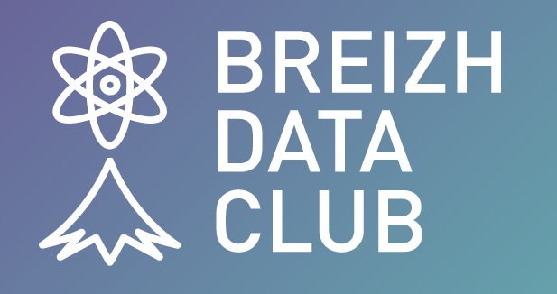

# QUI ?  Breizh Data Club

Communauté technique rennaise de l'association **BreizhCamp** rassemblant des passionnés pour les Data.
> (Les communautés techniques sont parfois nommées _User-Group_ ou _Meetup_ au sein de **BreizhCamp**)

## POUR QUI ?  For Data Lovers Only ! 

Pour tous ceux et toutes celles qui se reconnaissent sous l'un des intitulés suivants :
_Data-Scientist_, _Statisticien_, _Data-Analyst_, _Ingénieur Data_, _Ingéneur DataOps_, _Data Miner_, _Architecte Data_, _Data Manager_, _Admin de base de données (DBA)_, _Développeur B.I._, _Ingénieur Dataviz_, _Chief Data Officer_, _Data Protection Officer_, _Ingénieur Machine Learning_, _Ingénieur I.A._,  etc. ainsi que tous les métiers _data-driven_ . . .

## POURQUOI ?  For the pleasure of Data Lovers . . . 

Notre objectif est de satisfaire la curiosité et l'intérêt des _Data Lovers_

## AVEC QUOI ?  With different tools . . . 

### Un logo  pour rassembler les Data Lovers sous une même bannière 

### Des conférences thématiques 
* En soirée, de temps en temps, après le travail 
* Une journée complète une fois par an, le **Breizh Data Day**
* Et plus encore : des invitations à divers événements pour technophiles, etc.   

### Quelques liens utiles  
* [Site Meetup](https://www.meetup.com/fr-FR/breizh-data-club/) - Pour suivre notre actualité, _stay tuned_
* [Site BreizhCamp](https://www.breizhcamp.org/asso/) - Pour connaître les communautés techniques rennaises

>
> 

---

## [|||||||||] 
>
## Vous souhaitez nous contacter ? 
Pour écrire un message au **Breizh Data Club**, envoyez-nous un e-mail à

---
>
>

>  *  Version 2024-05-01

